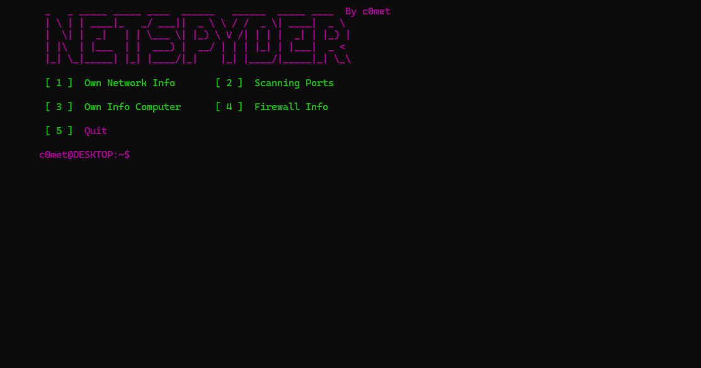

# NetSpyder - Fake ScriptKiddie

NetSpyder is a Fake ScriptKiddie mainly for Windows .

## Features

- To get some Information about your PC/Network...
- Easy-to-use

## Info
I did it for fun and kill the time, It's not a serious project .

You just have to enter a  this characters -> 1 or 2 or 3 or 4 or 5 to choose what you want

## Installation

### Clone the repository:
    git clone https://github.com/ton-username/ShieldPass.git
